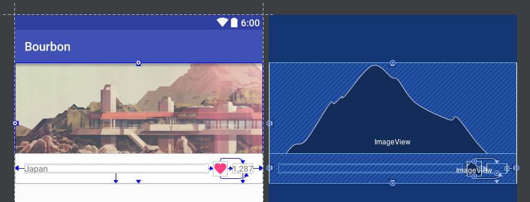
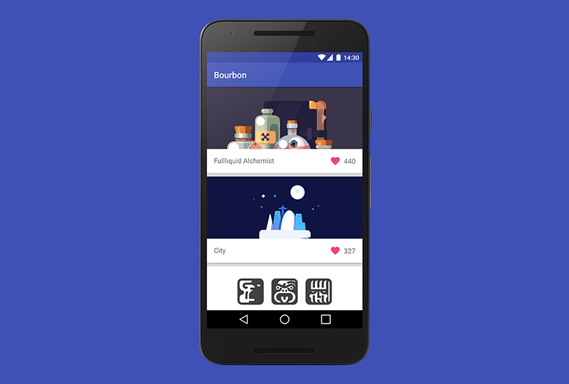

Constraints
===========
  [![Sidebar] (https://img.shields.io/badge/Sidebar-06%2F05%2F2016-orange.svg)](http://sidebar.io/2016/5/6)

    

An implementation of [Bourbon](https://github.com/hitherejoe/Bourbon) for Android Mobile, with the use of the new ConstraintLayout where possible for demonstration purposes.

The layout files can be found here:

- [Browse Fragment](https://github.com/hitherejoe/Constraints/blob/master/mobile/src/main/res/layout/fragment_browse.xml)
- [Shot Fragment](https://github.com/hitherejoe/Constraints/blob/master/mobile/src/main/res/layout/fragment_shot.xml)
- [Comment Item](https://github.com/hitherejoe/Constraints/blob/master/mobile/src/main/res/layout/item_comment.xml)
- [Shot Item](https://github.com/hitherejoe/Constraints/blob/master/mobile/src/main/res/layout/item_shot.xml)

    

Requirements
------------

 - [Android SDK](http://developer.android.com/sdk/index.html).
 - Android [5.0 (API 21) ](http://developer.android.com/tools/revisions/platforms.html#5.0).
 - Android SDK Tools
 - Android SDK Build tools 23.0.2
 - Android Support Repository
 - Android Support libraries

Building
--------

To build, install and run a debug version, run this from the root of the project:

    ./gradlew app:assembleDebug
    
    
Testing
-------

To run the Unit Test found in the CoreCommon module, run the following command from the root of the project:

	./gradlew corecommon:testDebugUnitTest

As mentioned the the structure section above, each of the instrumentation tests are split into a seperate module. You can run the instrumentation tests for these modules by running the commands below from the root of the project:

To run instrumentation tests for mobile:

	./gradlew mobile-androidTest:connectedAndroidTest

To run instrumentation tests for wear:

	./gradlew wear-androidTest:connectedAndroidTest

To run instrumentation tests for TV:

	./gradlew tv-androidTest:connectedAndroidTest
